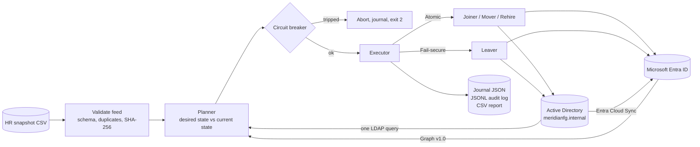
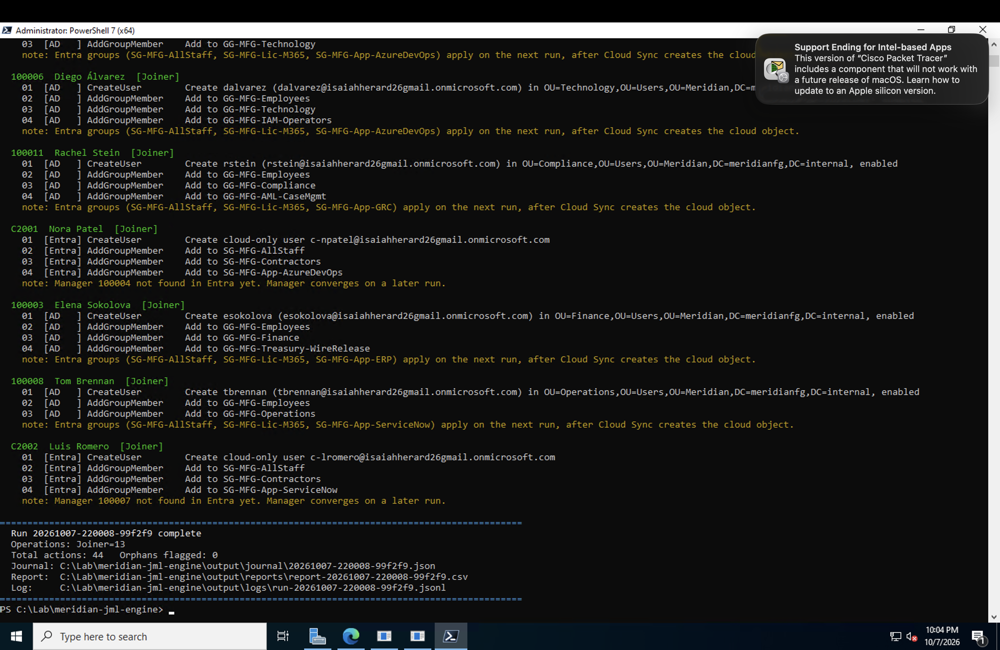
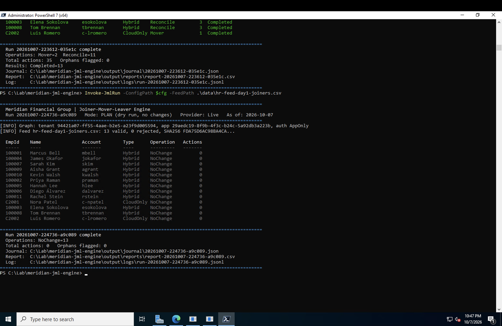
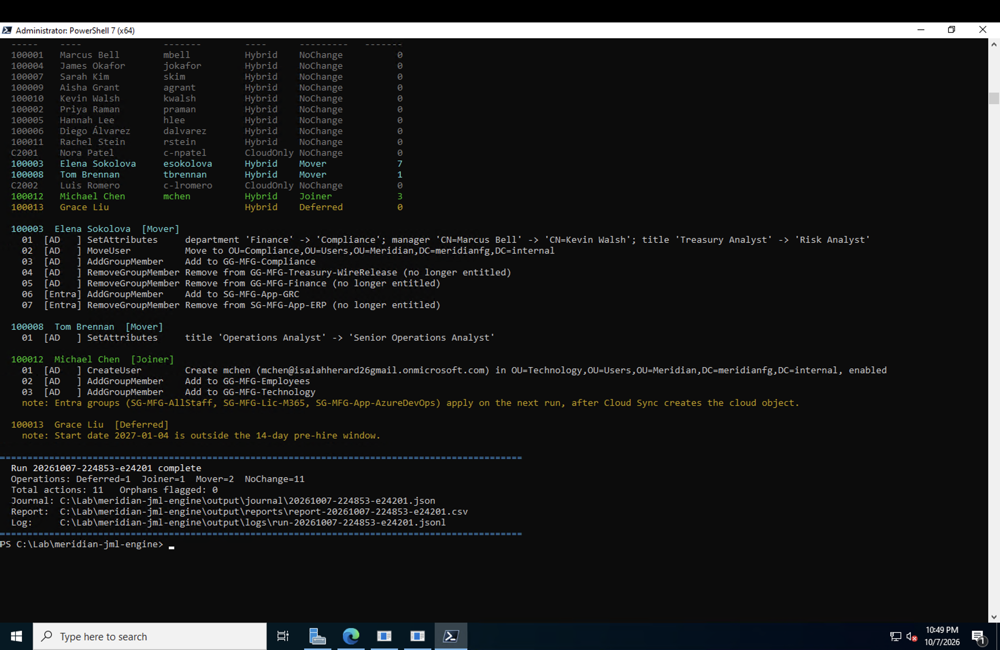
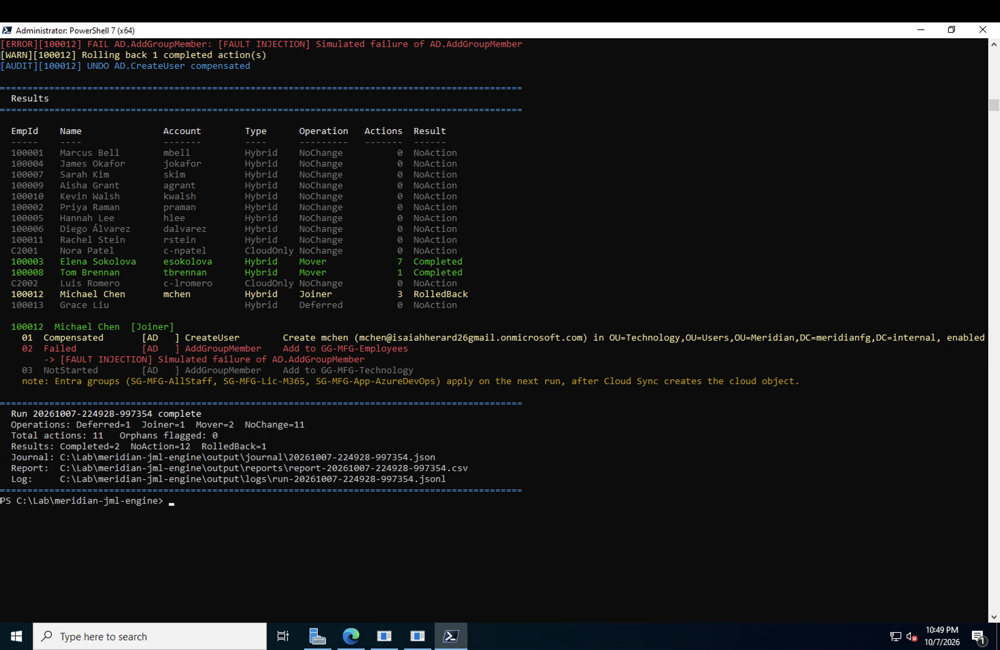
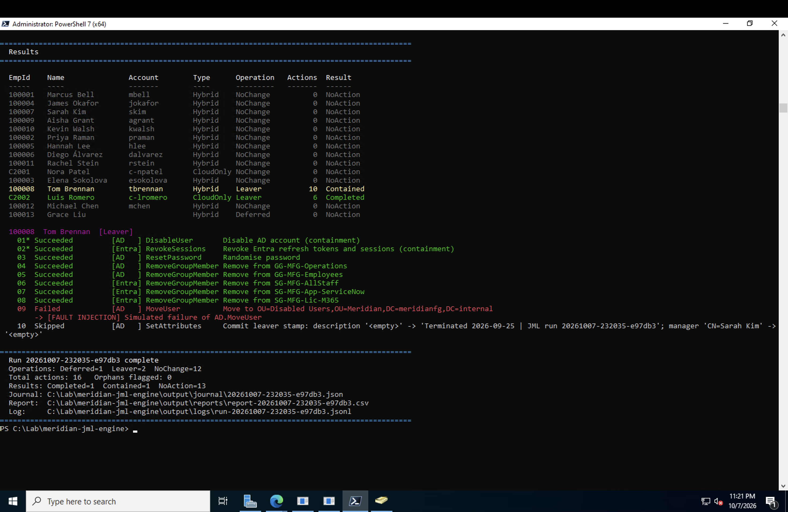
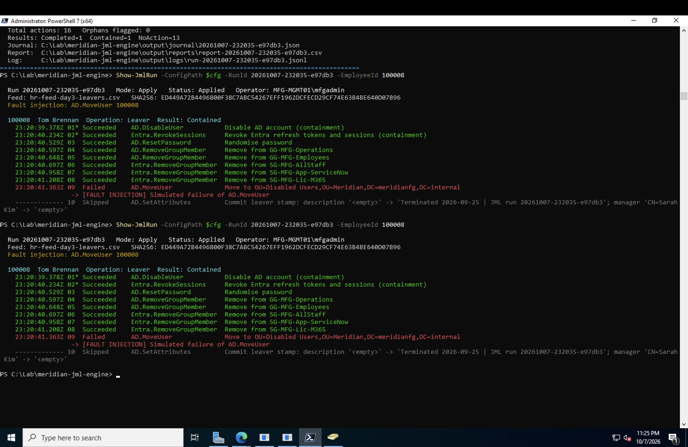
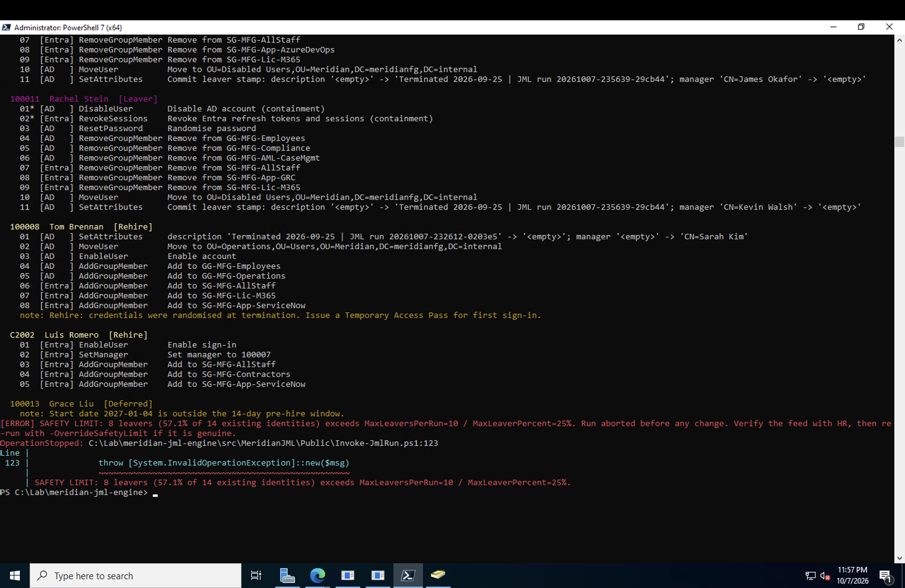
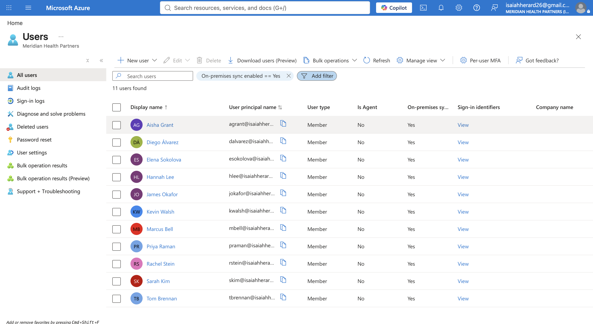

<div align="center">

# Meridian JML Engine

**Joiner-Mover-Leaver identity lifecycle automation for hybrid Active Directory and Microsoft Entra ID**


*Part 1 of **The PowerShell IAM / PAM / PIM Series***

</div>

---

## The problem

Every large company has the same three audit findings, year after year:

- **Terminated users who still have access.** HR files the termination on Friday, IT disables the account on Tuesday, and the audit sample finds four days of exposure.
- **Access creep.** People change jobs and keep everything from the old one. The analyst who moved from Treasury to Compliance can still release wires.
- **Half-finished scripts.** A deprovisioning script dies halfway through and leaves an account disabled in AD, alive in the cloud, and still in six groups. Nobody can say what state it is in.

Meridian Financial Group (a fictional mid-size bank) runs a hybrid directory: on-prem Active Directory synced to Microsoft Entra ID with Entra Cloud Sync, plus cloud-only contractors. This engine takes the daily HR snapshot and drives both directories to match it.

## What it does

| HR event | Hybrid employee (AD, synced to Entra) | Cloud-only contractor (Entra) |
|---|---|---|
| **Joiner** | Creates the AD account in the department OU, sets manager, adds birthright groups. After Cloud Sync, adds Entra groups. | Creates the Entra user through Graph, sets manager, adds Entra groups. |
| **Mover** | Updates attributes, moves OUs, adds new-role groups and **removes old-role groups** in AD and Entra. | Updates attributes and group membership through Graph. |
| **Leaver** | Disables the account and revokes Entra sessions first, then randomises the password, strips groups, clears the manager, moves to Disabled Users, stamps the record. | Blocks sign-in and revokes sessions first, then strips groups and clears the manager. |
| **Rehire** | Re-enables, moves back, restores entitlements, flags that a Temporary Access Pass is needed. | Re-enables sign-in and restores entitlements. |
| **Drift** | Removes managed groups someone added by hand. | Same. |

## Design decisions that matter

**1. Idempotent by construction, not by flags.** The engine never asks "did I already do this?" It compares what HR says against what the directory has right now and plans only the difference. Run it twice and the second run plans nothing. There is no state file that can drift out of sync with reality.

**2. Two failure policies, because joiners and leavers fail differently.**

| | Joiner / Mover / Rehire | Leaver |
|---|---|---|
| Policy | **Atomic** | **Fail-secure** |
| On a failed step | Stop, then run the compensating action for every completed step in reverse order. The identity ends fully changed or exactly as it was. | Keep going. Rolling back a termination would hand access back to someone who should not have it. |
| Ordering | As planned | Containment first (disable, revoke sessions), cleanup second, commit stamp last |
| Result states | `Completed`, `RolledBack`, `RollbackFailed` | `Completed`, `Contained`, `ContainmentFailed` |

A leaver whose cleanup fails ends up `Contained`: no access, a precise list of what is pending, and no "Terminated" stamp. The stamp is a commit marker, so the next run sees unfinished work and finishes it. If a *containment* step fails, cleanup is held back on purpose, so the next plan retries containment before anything else.

**3. A circuit breaker for bad HR extracts.** If a run would terminate more than 10 people, or more than 25% of existing identities, it aborts before touching anything. A broken HR export should cause a phone call, not a company-wide lockout. Overrides are possible and journaled with the operator's name.

**4. The engine only removes access it owns.** Groups named in `config/access-model.json` are managed. Anything else (a privileged group, a project share someone approved by ticket) is left alone for active workers. Leavers lose all AD group memberships.

**5. Missing from the feed is not the same as terminated.** Enabled accounts that HR stopped sending are reported as orphans for review. They are never disabled automatically.

**6. Least-privilege app identity.** Graph access is app-only with a certificate whose private key is non-exportable. Two application permissions: `User.ReadWrite.All` and `GroupMember.ReadWrite.All`. No secrets, no `Directory.ReadWrite.All`. The AD side can run under a group delegated only on `OU=Meridian` (`lab/03-Grant-JmlDelegation.ps1`).

**7. Hybrid-aware.** Synced users are mastered on-prem, so the engine writes them in AD and only touches Entra for what AD cannot do (cloud group membership, session revocation). It never PATCHes an on-prem mastered object through Graph.

## Architecture



Details, action catalog and failure matrix: [docs/ARCHITECTURE.md](docs/ARCHITECTURE.md).

## Screenshots

> Captured from the live lab: Windows Server 2022 DC in Azure, Entra Cloud Sync, and a Microsoft Entra tenant.

| | |
|---|---|
| **Day 1 plan (dry run)** | **Second run: nothing to do** |
|  |  |
| **Mover strips old-role access** | **Joiner rolled back after a failure** |
|  |  |
| **Leaver contained despite a failure** | **Audit trail from the journal** |
|  |  |
| **Circuit breaker stops a bad extract** | **Synced users in Entra** |
|  |  |

## Quick start

### Try it on any machine (no lab needed)

The simulated provider is an in-memory AD and Entra pair with a stand-in Cloud Sync cycle. Same planner, same executor.

```powershell
# macOS: brew install --cask powershell   |   Windows: winget install Microsoft.PowerShell
pwsh
Copy-Item ./config/jml.config.example.psd1 ./config/jml.config.psd1
Import-Module ./src/MeridianJML/MeridianJML.psd1

$cfg = './config/jml.config.psd1'
Invoke-JmlRun -ConfigPath $cfg -FeedPath ./data/hr-feed-day1-joiners.csv -Simulated            # plan
Invoke-JmlRun -ConfigPath $cfg -FeedPath ./data/hr-feed-day1-joiners.csv -Simulated -Apply     # apply
Invoke-JmlRun -ConfigPath $cfg -FeedPath ./data/hr-feed-day3-leavers.csv -Simulated -Apply `
    -SimulateFailure AD.MoveUser -SimulateFailureFor 100008                                     # break it on purpose
```

### Run it against a real hybrid lab

Follow [docs/WALKTHROUGH.md](docs/WALKTHROUGH.md). It builds the Azure VM, the forest, Cloud Sync and the app registration, then walks the three HR days end to end.

## Commands

| Command | Purpose |
|---|---|
| `Invoke-JmlRun -ConfigPath -FeedPath` | Plan only. Reads everything, writes nothing, saves the plan as change evidence. |
| `Invoke-JmlRun ... -Apply` | Execute the plan. |
| `Invoke-JmlRun ... -OverrideSafetyLimit` | Proceed past the circuit breaker (journaled). |
| `Show-JmlRun -ConfigPath -List` | List past runs. |
| `Show-JmlRun -ConfigPath -RunId [-EmployeeId]` | Print the per-action audit trail for a run. |
| `Undo-JmlRun -ConfigPath -RunId [-EmployeeId] [-WhatIf]` | Break-glass reversal of an applied run from its journal. |
| `scripts/Start-JmlRun.ps1 -FeedPath [-Apply]` | Scheduler entry point with exit codes: 0 ok, 1 retry pending, 2 safety abort, 3 containment failed, 4 engine error. |

## Evidence every run produces

| File | Contents |
|---|---|
| `output/journal/<RunId>.json` | Full plan and outcome: every action, its before-state, its undo, timestamps, status, errors, operator, feed SHA-256. |
| `output/logs/run-<RunId>.jsonl` | One JSON line per event. Ready for Sentinel, Splunk or any SIEM. |
| `output/reports/report-<RunId>.csv` | One row per identity for the access review or the auditor. |

Passwords are generated at execution time and never logged.

## Controls this supports

| Framework | Control | How |
|---|---|---|
| PCI DSS v4.0 | 8.2.4, 8.2.5 | Adds, changes and removals follow the authoritative HR record; terminated access is revoked on the next run, containment first. |
| SOX ITGC | Logical access: provisioning, deprovisioning, transfers | Plan files are change evidence; journals show who ran what, from which feed hash. |
| ISO/IEC 27001:2022 | A.5.16, A.5.18 | Identity lifecycle and access rights driven from one source of truth. |
| NIST SP 800-53 | AC-2, AC-2(3) | Account management, disabling accounts of departed users. |

## Testing

```powershell
Invoke-Pester ./tests
```

- `tests/MeridianJML.Tests.ps1` runs the whole three-day story on the simulated directory: idempotency, rollback, fail-secure leavers, circuit breaker, orphans, naming collisions.
- `tests/LiveProvider.Contract.Tests.ps1` exercises the **live** AD and Graph code path against test doubles of the `ActiveDirectory` and `Microsoft.Graph.Authentication` modules. The doubles copy the behaviour that breaks real scripts: absent AD attributes, Graph 404s, duplicate-member 400s, on-prem mastered objects rejecting cloud writes, and `employeeId` filters that need `ConsistencyLevel: eventual`.

Both run in GitHub Actions on every push.

## Repository layout

```
config/            engine config (example) and the birthright access model
data/              sample HR snapshots: day 1 joiners, day 2 movers, day 3 leavers, bad extract, invalid rows
docs/              architecture, step-by-step lab walkthrough, screenshots
lab/               Azure VM, forest, OU/group build, AD delegation, app registration, Entra groups
scripts/           unattended entry point with exit codes
src/MeridianJML/   the module (Public = commands, Private = planner, executor, providers)
tests/             Pester suites and AD/Graph test doubles
```

## Roadmap

- HR source adapters for Workday and SuccessFactors APIs alongside CSV
- Graph `$batch` for large populations
- Temporary Access Pass issuance for joiners and rehires
- Hand-off to Entra Lifecycle Workflows (`employeeLeaveDateTime`) for mailbox and OneDrive tasks
- Part 2 of the series: privileged account lifecycle and PIM role assignment

## License

MIT. See [LICENSE](LICENSE).
