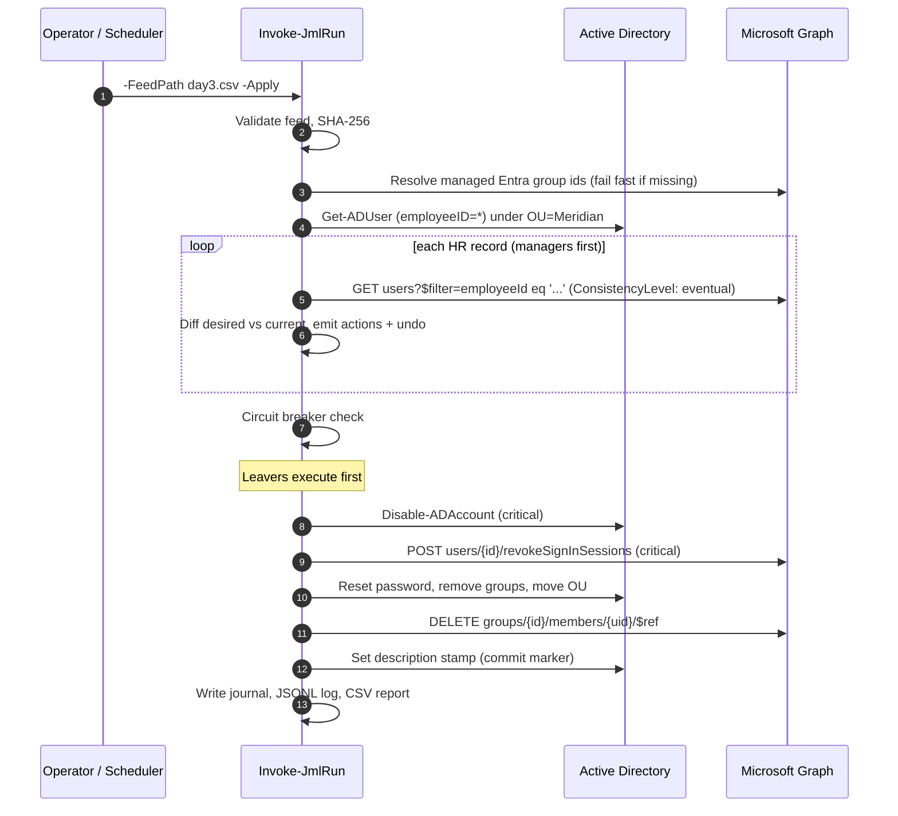
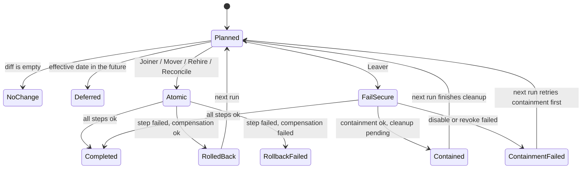

# Architecture

## Components

| Layer | File | Responsibility |
|---|---|---|
| Feed | `Public/Import-JmlHrFeed.ps1` | Parse the CSV, validate every row, reject duplicates, hash the file. |
| Planner | `Private/40-Planner.ps1` | Build desired state per identity, diff against current state, emit actions with their undo. Never writes. |
| Executor | `Private/50-Executor.ps1` | Run actions under the Atomic or Fail-secure policy, compensate on failure, write the journal and report. |
| AD provider | `Private/10-Provider.AD.ps1` | All AD reads and writes. One LDAP query loads the managed population. |
| Entra provider | `Private/20-Provider.Entra.ps1` | All Graph calls through `Invoke-MgGraphRequest`, with retry on 429 and 5xx. |
| Simulated provider | `Private/30-Provider.Simulated.ps1` | In-memory AD and Entra with a Cloud Sync stand-in, for CI and demos. |
| Commands | `Public/*.ps1` | `Invoke-JmlRun`, `Show-JmlRun`, `Undo-JmlRun`, `Connect-JmlGraph`. |

## Run sequence

## Identity anchor

`employeeID` (AD) and `employeeId` (Entra) carry the HR worker ID. Names and UPNs change; the worker ID does not. If Cloud Sync in a given tenant does not flow `employeeID`, the Entra lookup falls back to UPN, and a UPN hit that carries a *different* `employeeId` is refused as a collision instead of being treated as a match.

Two AD accounts with the same `employeeID` stop the run: that is a data integrity problem a human has to settle.

## Action catalog

| Key | Critical | Undo | How the planner knows it is already done |
|---|---|---|---|
| `AD.CreateUser` | | `AD.RemoveUser` | An account with this `employeeID` exists |
| `AD.SetAttributes` | | `AD.SetAttributes` with From/To swapped | Attribute values already equal desired values |
| `AD.MoveUser` | | `AD.MoveUser` back to the original OU | Parent container equals the target OU |
| `AD.AddGroupMember` | | `AD.RemoveGroupMember` | `memberOf` already contains the group |
| `AD.RemoveGroupMember` | | `AD.AddGroupMember` | `memberOf` no longer contains the group |
| `AD.EnableUser` | | `AD.DisableUser` | Account enabled |
| `AD.DisableUser` | Yes (leaver) | `AD.EnableUser` | Account disabled |
| `AD.ResetPassword` | | none (irreversible) | Leaver stamp present |
| `Entra.CreateUser` | | `Entra.DeleteUser` (soft delete) | A user with this `employeeId` exists |
| `Entra.SetAttributes` | | swapped | Values equal |
| `Entra.SetManager` / `ClearManager` | | the opposite | `manager` reference matches |
| `Entra.AddGroupMember` / `RemoveGroupMember` | | the opposite | `memberOf` contains / lacks the group id |
| `Entra.DisableUser` | Yes (leaver) | `Entra.EnableUser` | `accountEnabled` is false |
| `Entra.RevokeSessions` | Yes (leaver) | none (irreversible) | Hybrid: leaver stamp present and account disabled. Cloud-only: no leaver work left and `signInSessionsValidFromDateTime` after the termination date |

Every action is written to the journal with its parameters, its undo, timestamps and status, which is what makes `Undo-JmlRun` possible.

## Per-identity outcome

## Failure matrix

| Scenario | What happens | What the next run does |
|---|---|---|
| Joiner fails after the AD account is created | Account and any group adds are removed. Result `RolledBack`. | Provisions from scratch. |
| Mover fails halfway through group changes | Completed steps are reversed. The worker keeps their old, consistent access. | Retries the full move. |
| Leaver: OU move fails | Account disabled, sessions revoked, groups removed. Stamp withheld. Result `Contained`, exit code 1. | Moves the account, writes the stamp. |
| Leaver: session revocation fails | Other containment steps still run. Cleanup and stamp withheld. Result `ContainmentFailed`, exit code 3 for paging. | Plans the revoke again. |
| HR extract marks 60% of staff terminated | Nothing changes. Journal status `AbortedBySafetyLimit`, exit code 2. | Same, until the feed is fixed or an operator overrides. |
| Row with unknown department or bad date | Row rejected and logged. Everyone else processed. | Same until HR fixes the row. |
| Worker dropped from the feed | Reported as an orphan. Account untouched. | Same. |
| Cloud Sync has not created the cloud object yet | AD work completes. Entra group work waits (`PendingSync`). | Adds the Entra groups. |
| Graph throttles (429) | Exponential back-off, up to 4 attempts. | n/a |

## Rollback versus the source of truth

`Undo-JmlRun` replays the recorded before-state of a run. It is a break-glass tool for the hours between "HR terminated the wrong person" and "HR fixed the record". Because the engine is desired-state, the next scheduled run will terminate that worker again if the HR record still says Terminated. The permanent fix is always in HR; the engine then processes it as a **Rehire**.

## Security model

| Identity | Where | Rights |
|---|---|---|
| `MFG-JML-Engine` app registration | Entra | Application permissions `User.ReadWrite.All`, `GroupMember.ReadWrite.All`. Certificate credential, private key non-exportable on the automation host. |
| `GG-MFG-JML-Operators` | AD | Create/delete users in `OU=Users` and `OU=Disabled Users`; read/write user properties and Reset Password under `OU=Meridian`; write `member` on groups in `OU=Groups`. |
| Lab admin (`mfgadmin`) | AD | Domain Admin. Used to build the lab only. |

Graph app-only permissions cannot change the passwords or sign-in state of accounts that hold privileged directory roles; privileged identities are out of scope here and belong to Part 2 of the series (PAM and PIM).

## Scale notes

- AD state loads in one paged LDAP query regardless of population size.
- Entra lookups are per worker in the feed. For tens of thousands of workers, the next step is Graph `$batch` (20 requests per call) and a delta query on users.
- The executor treats one identity as one unit of work, so a failure never blocks the rest of the population.
